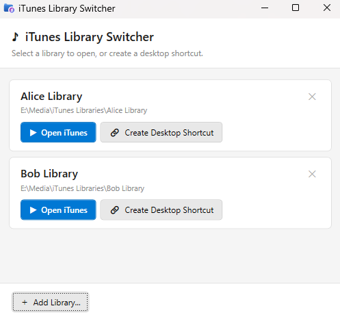

# iTunes Library Switcher

DIY launcher tool for switching between multiple iTunes libraries on Windows, without holding Shift.

## Background

iTunes on Windows supports multiple libraries, but switching between them requires:

1. Fully closing iTunes
2. Holding **Shift** while launching iTunes
3. Picking a `.itl` file from a dialog every single time

The Shift key interaction is not hard, but it is hidden and easy to forget over time. It can also be awkward for children, shared family PCs, or anyone who just wants a simpler point-and-click way to open the right library. This repo shows the DIY script-based way to create a simple double-clickable launcher per library that switches to the right one and opens iTunes automatically.

> **How was this discovered?** See [`INVESTIGATION.md`](INVESTIGATION.md) for the full reverse-engineering walkthrough using ProcMon differential analysis and binary plist parsing.

---

## Want a GUI Instead?

**[$3.99 on Ko-fi →](https://ko-fi.com/s/203812a2b6)**

If you'd rather not set up Python and `.cmd` files, or you just want to buy me a coffee for this investigation, there's a **desktop app** version with a point-and-click interface:

- Browse and add your libraries from a visual list
- One-click **Open iTunes** button per library
- **Create Desktop Shortcut** generates a one-click `.lnk` launcher so you never need to open the app again
- Detects whether iTunes is installed and warns you if it's still running
- No Python required, just download and run

If you want the easiest path, get the desktop app. If you prefer the free DIY route, the rest of this README shows how to set up the script version manually.

| Version | Best For | Setup |
|---|---|---|
| Free script version (this repo) | Technical users comfortable with Python and `.cmd` files | Manual |
| Desktop app | Families, shared PCs, and anyone who wants point-and-click setup | Download and run |



---

## Requirements

| Requirement | Notes |
|---|---|
| Windows 10 or 11 | |
| iTunes **Windows Store (UWP) edition** | This tool targets the Store version of iTunes, not the legacy `.exe` installer |
| Python 3 | Standard library only, no `pip install` needed. Get it from [python.org](https://www.python.org/) |
| iTunes run at least once per library | Each library must already exist on disk |
| Comfort editing simple launcher files | This version is meant for DIY/script-based setup |

---

## How It Works

iTunes stores the last-opened library path in a binary Apple plist file:

```
%LOCALAPPDATA%\Packages\AppleInc.iTunes_nzyj5cx40ttqa\LocalCache\
    Roaming\Apple Computer\Preferences\com.apple.iTunes.plist
```

Three keys inside this file control which library opens:

| Key | Format |
|---|---|
| `DATA:1:iTunes Library Location` | Library folder path (UTF-16LE bytes) |
| `Database Location` | `file://localhost/` URL pointing to the `.itl` file |
| `LXML:1:iTunes Library XML Location` | Path to the `.xml` export (UTF-16LE bytes) |

`launch_itunes_library.py` rewrites these three keys and launches iTunes. iTunes then opens the specified library without any Shift-click prompt.

---

## Quick Start (Free Script Version)

If you just want a point-and-click app, use the Ko-fi desktop app above. The steps below are for the free script-based workflow.

### 1. Create a launcher script for each library

Copy the template from [`examples/`](examples/) or create a `.cmd` file manually:

**`iTunes - Alice.cmd`**
```cmd
@echo off
python "%~dp0launch_itunes_library.py" "D:\Music\iTunes Libraries\Alice Library"
```

**`iTunes - Bob.cmd`**
```cmd
@echo off
python "%~dp0launch_itunes_library.py" "D:\Music\iTunes Libraries\Bob Library"
```

Replace the paths with your actual library folder paths. Each folder must contain an `iTunes Library.itl` file.

### 2. Double-click to launch

Make sure iTunes is **fully closed**, then double-click any launcher. iTunes will open directly into the correct library.

### 3. Optional: Pin to Start or taskbar

Right-click the `.cmd` file, then choose **Send to > Desktop (create shortcut)**. You can then pin the shortcut to the Start menu or taskbar. To change the icon to the iTunes icon, right-click the shortcut, choose Properties, click Change Icon, and browse to:
```
C:\Program Files\WindowsApps\AppleInc.iTunes_<version>_x64__nzyj5cx40ttqa\iTunes.exe
```

---

## Files

| File | Purpose |
|---|---|
| `launch_itunes_library.py` | Core script - patches the plist and launches iTunes |
| `examples/iTunes - Alice.cmd` | Example launcher for a library named "Alice Library" |
| `examples/iTunes - Bob.cmd` | Example launcher for a library named "Bob Library" |
| `INVESTIGATION.md` | Full reverse-engineering walkthrough |

---

## Important Notes

- **iTunes must be fully closed** before running a launcher. If iTunes is open, the plist will be overwritten by iTunes again on exit.
- This tool only changes 3 keys out of 18 in the plist. All other preferences (EQ, window layout, Gracenote IDs, AirPlay config, etc.) are untouched.
- A mirror copy of the plist at `%APPDATA%\Apple Computer\Preferences\com.apple.iTunes.plist` is also patched automatically if it exists.
- Tested against iTunes Windows Store edition version 12.x (`AppleInc.iTunes_nzyj5cx40ttqa`).

---

## License

MIT